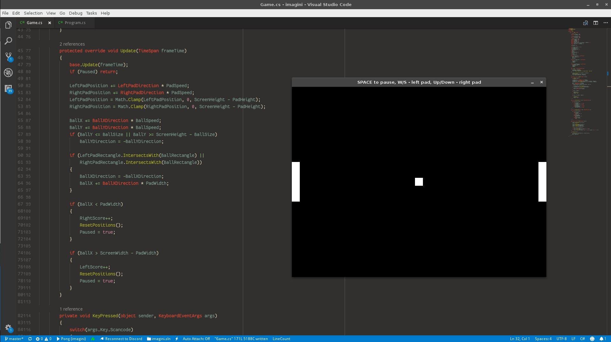

### Imagini - cross-platform .NET game/app framework
Imagini is a modular solution for building games and multimedia apps using .NET Core/Standard. It's based on SDL2 library and should run pretty much everywhere where the .NET runtime and SDL2 library is present.

[ ](https://project-grove.github.io/imagini/coverage/)

NuGet packages will be published when this project reaches RC or stable state (whatever will come first). For now it can be tinkered with, but the API may change (hopefully not much).

Note: SDL2 native binary should be present on the system. This project doesn't bundle it, so you may need to provide it by yourself.

---
### Packages 
#### Imagini.Core
Base module. It implements the following functionality:
* **Window creation** with ability to choose backend
* **Event handling** - mouse, keyboard, gamepads, touch, window state and others
* **App/game loop** - variable and fixed timesteps, works similar to XNA/MonoGame loop
* **Display device enumeration** - queries available display devices and their modes

[API Documentation](https://project-grove.github.io/imagini/api/core/)

#### Imagini.2D
2D rendering module. Built around SDL2's [Render](https://wiki.libsdl.org/CategoryRender) and [Surface](https://wiki.libsdl.org/CategorySurface) APIs.

It provides the following features:
* **Drawing sprites** at any position and angle, from the whole texture or it's part
* Several **blend modes and modulation**
* Drawing single-pixel **points**, single-pixel **lines**, wireframe and filled **rectangles**
* **Render-to-texture** if the underlying backend supports it
* Texture and surface pixel data manipulation

It does not contain image file loaders.

[API Documentation](https://project-grove.github.io/imagini/api/2d/)


#### Imagini.ImageSharp
Texture and surface loader module. Allows for texture and surface creations from image files and streams. Powered by [SixLabors/ImageSharp](https://github.com/SixLabors/ImageSharp).

The following image file formats are supported:
* PNG
* JPEG
* BMP
* GIF

[API Documentation](https://project-grove.github.io/imagini/api/imagesharp/)


#### Imagini.Fonts
Sprite font generator and renderer module. Powered by [SixLabors/Fonts](https://github.com/SixLabors/Fonts) and [SixLabors/ImageSharp](https://github.com/SixLabors/ImageSharp).

Features include:
* **TTF** and **WOFF** font loading
* **Font bitmap generation** based on font size and style specified
* ``ITextRenderer`` interface and it's implementation for  **Imagini.2D Graphics** API

[API Documentation](https://project-grove.github.io/imagini/api/fonts/)

### Planned packages
* Imagini.Veldrid - [Veldrid](https://github.com/mellinoe/veldrid) integration

---
### Unimplemented features
#### Sound API
Check out the [vox](https://github.com/project-grove/vox) project. It provides a full 3D sound solution based on OpenAL.

---
### Samples
* [Pong](https://github.com/project-grove/imagini/blob/master/Samples/Pong/Game.cs)


---
### Building
This project uses [Cake](https://cakebuild.net/) building system. To build the project, use:
```
./build.sh
# OR
./build.ps1
```

Refer to the [build script](https://github.com/project-grove/imagini/blob/master/build.cake) for command line options.

Don't forget to init and pull Git submodules!